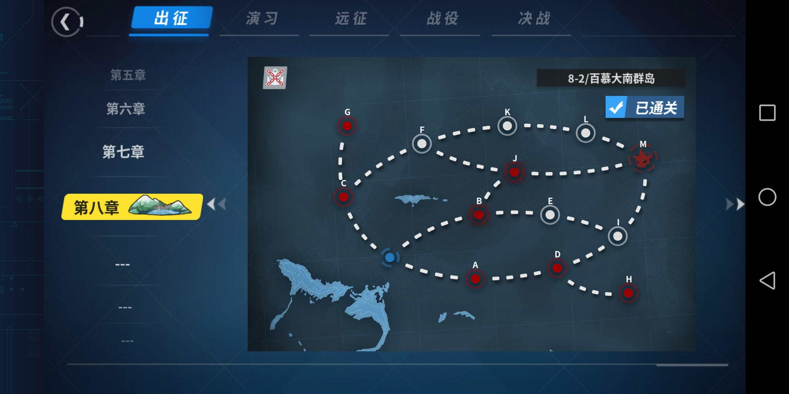

# WSGR Script for 8-2

This is a script that automatically go to expedition in map 8-2 point B.

Most auto scripts on github directly simulates the game client and makes artificial
requests to the game server. This script however, like most modern FGO scripts on github,
is based on ADB, OpenCV and pattern recognition. This reduced the risk of being banned.
(However Moefantasy haven't put anyone on banlist since 2018.4)

## Usage

#### Notice: It's strongly suggested to use a real device rather than simulator.

Android simulators may skip some ADB instructions if there is too heavy load for the simulator.
This will cause the script to fall into incorrect state and stop working.

* Step 1: Add ADB (that supports `adb exec-out`) to `PATH`.
* Step 2: Connect the device via ADB.
* Step 3: Open your WSGR client, tap "go to expedition" and make sure the screen is as `default.jpg`:

Also, make sure that your default fleet has a CL as a flagship.
* Step 4: Run `python main.py`. Script will automatically run repeatedly with your default fleet.

By default, the script will stop running if it has got 50 ships. You may also modify `main.py` to your need.

## Requirements

* Python >= 3.7.0
* opencv-python (cv2) >= 3.1.0

---

# 战舰少女R 8-2 脚本

这个脚本可以用来自动刷8-2B点练级。

目前Github上的大部分舰R脚本都是直接模拟客户端来跟服务器通信。然而这个脚本跟很多FGO的脚本类似，
是基于ADB和OpenCV，通过模式识别而生效的。这减少了被封号的风险（因为这样服务器能接收到的请求
跟正常的请求没有任何区别）（然而幻萌在2018年4月份之后貌似就没封过号了）。

## 使用说明

#### 注意：强烈建议在实体机而非模拟器上使用。

安卓模拟器卡顿的时候会吞掉ADB的指令；这样会导致脚本不能正常工作，而是卡住。

* 1: 把一个支持`adb exec-out`的ADB添加到`PATH`
* 2: 连接ADB
* 3: 打开舰R，确保你的界面跟 `default.jpg`一样:

并且确认默认的舰队是需要练级的舰队，且有CL为旗舰。

* 4: 运行 `python main.py`，脚本会自动循环执行

默认情况下，脚本会在获得50条船之后停止。也可以改动脚本以符合自己需要。

## 需求

* Python >= 3.7.0
* opencv-python (cv2) >= 3.1.0